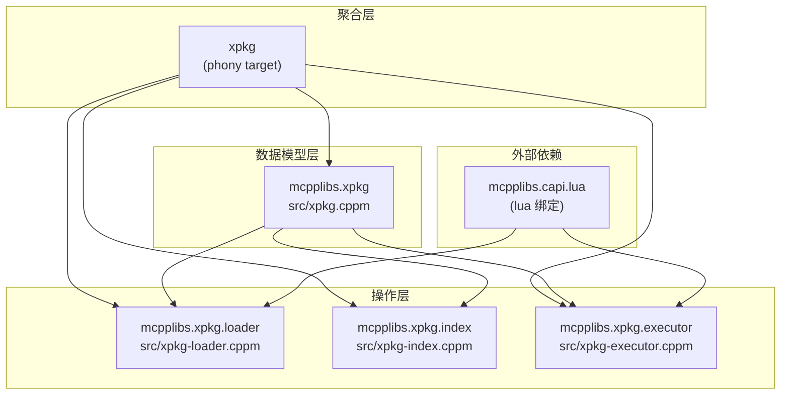

# 架构文档

> mcpplibs/libxpkg 项目架构与设计说明

## 概述

`mcpplibs/libxpkg` 是 **xpkg 包描述规范的 C++23 标准库（参考实现）**。它提供四个独立的 C++23 模块，让任何 C++ 工具都能读取、操作和执行 xpkg 格式的包及索引，而无需依赖 xlings 本身。

## 模块概览

libxpkg 由四个按依赖分层的子模块组成，并提供聚合 target `xpkg` 一次引入全部模块：

```
xpkg (聚合 target)         ← add_deps("xpkg") 引入以下全部模块
├── mcpplibs.xpkg          ← 纯 C++ 数据模型，零外部依赖
├── mcpplibs.xpkg.loader   ← 依赖 model + lua 库；解析 .lua 文件
├── mcpplibs.xpkg.index    ← 依赖 model；纯 C++ 索引操作
└── mcpplibs.xpkg.executor ← 依赖 model + lua 库；执行钩子
```

### 依赖关系



## 模块说明

### mcpplibs.xpkg — 数据模型层

零外部依赖的纯 C++ 数据结构，定义 xpkg 规范中的所有核心类型：

| 类型 | 说明 |
|------|------|
| `Package` | 完整的 xpkg 包定义（元数据 + 平台矩阵） |
| `PlatformMatrix` | 多平台资源矩阵（平台 → 版本 → 资源） |
| `PackageIndex` | 包索引（条目映射 + 互斥组） |
| `IndexRepos` | 索引仓库配置（主仓库 + 子仓库列表） |
| `PackageType` | 包类型枚举（Package/Script/Template/Config） |
| `PackageStatus` | 包状态枚举（Dev/Stable/Deprecated） |

### mcpplibs.xpkg.loader — 加载层

通过 Lua C API 解析 `.lua` 格式的包定义文件：

- `load_package(path)` — 解析单个 xpkg `.lua` 文件 → `Package`
- `load_index_repos(path)` — 解析 `xim-indexrepos.lua` → `IndexRepos`
- `build_index(repo_dir)` — 扫描 `pkgs/` 目录构建 `PackageIndex`
- `load_index_db(path)` / `save_index_db(index, path)` — JSON 格式索引持久化

### mcpplibs.xpkg.index — 索引层

纯 C++ 索引查询与管理操作（无 Lua 依赖）：

- `search(index, query)` — 模糊搜索包名/描述
- `resolve(index, name)` — 解引用别名（"vscode" → "vscode@1.85.0"）
- `match_version(index, name)` — 最优版本匹配
- `mutex_packages(index, pkg)` — 查询互斥包
- `merge(base, overlay)` — 合并主仓库与子仓库索引
- `set_installed(index, name, flag)` — 更新安装状态

### mcpplibs.xpkg.executor — 执行层

加载包 Lua 文件并执行标准钩子函数：

- `create_executor(pkg_path)` — 创建包执行器
- `PackageExecutor::run_hook(hook, ctx)` — 执行指定钩子
- `PackageExecutor::check_installed(ctx)` — 检查安装状态
- 支持钩子：`installed` / `build` / `install` / `config` / `uninstall`

#### Lua 运行时兼容层

executor 通过 `prelude.lua`（编译时嵌入 `xpkg-lua-stdlib.cppm`）为包脚本提供 xmake 兼容的运行环境。xpkg V1 规范的包脚本沿用了 xmake 的编程约定，因此 executor 需要兼容这些约定：

| 类别 | 兼容项 | 说明 |
|------|--------|------|
| 模块系统 | `import()` 自动注册全局变量 | `import("xim.libxpkg.pkginfo")` 后可直接用 `pkginfo.xxx()` |
| 内置模块 | `pkginfo`, `xvm`, `log`, `system`, `utils` | 读取 `_RUNTIME` 上下文，通过 `_LIBXPKG_MODULES` 注册 |
| 全局函数 | `is_host()`, `format`, `raise`, `cprint`, `try` | xmake 内建函数的兼容实现 |
| OS 扩展 | `os.tryrm`, `os.mkdir`, `os.mv`, `os.cp`, `os.dirs`, `os.host` | 跨平台文件操作 |
| 字符串扩展 | `string.replace`, `string.split` | xmake 字符串方法兼容 |
| 路径模块 | `path.join`, `path.filename`, `path.directory` | 跨平台路径操作 |

**Loader vs Executor 的区别：**

- **Loader**（`xpkg-loader.cppm`）：仅解析包元数据，所有函数为安全的 stub（如 `is_host()` 返回 `false`）
- **Executor**（`xpkg-executor.cppm` + `prelude.lua`）：运行实际钩子，提供功能完整的实现（如 `is_host()` 读取 `_RUNTIME.platform`）

> **后期优化方向：** 当前兼容层是对 xmake 运行时的逐项适配。后续应从 xpkg 规范层面明确定义包脚本运行时 API（而非隐式依赖 xmake 约定），在 libxpkg 中实现规范定义的标准运行时，减少对 xmake 兼容层的依赖。具体包括：
> 1. 在 xpkg 规范中显式声明包脚本可用的全局函数、模块和 OS API
> 2. libxpkg executor 按规范提供标准运行时，替代当前的 xmake 兼容 shim
> 3. 提供规范合规性检查工具，帮助包作者验证脚本是否仅使用规范 API

## 目录结构

```
libxpkg/
├── src/
│   ├── xpkg.cppm              # mcpplibs.xpkg (数据模型)
│   ├── xpkg-loader.cppm       # mcpplibs.xpkg.loader
│   ├── xpkg-index.cppm        # mcpplibs.xpkg.index
│   └── xpkg-executor.cppm     # mcpplibs.xpkg.executor
├── tests/
│   ├── main.cpp
│   ├── test_loader.cpp
│   ├── test_index.cpp
│   ├── test_executor.cpp
│   └── xmake.lua
├── examples/
│   ├── basic.cpp              # 加载包元数据示例
│   ├── index_demo.cpp         # 构建并搜索索引示例
│   └── xmake.lua
├── docs/
│   └── architecture.md        # 本文档
├── .agents/
│   ├── skills/
│   └── plans/
│       └── 2026-03-01-libxpkg-design.md   # 完整设计方案
├── xmake.lua
├── CMakeLists.txt
└── README.md
```

## 编码规范

遵循 [mcpp-style-ref](https://github.com/mcpp-community/mcpp-style-ref) 编码规范：

| 类别 | 风格 | 示例 |
|------|------|------|
| 类型名 | PascalCase | `Package`, `IndexEntry` |
| 函数 | snake_case | `load_package()`, `build_index()` |
| 私有成员 | `_` 后缀 | `state_`, `path_` |
| 命名空间 | 全小写 | `mcpplibs::xpkg` |

## 参考资料

- [完整设计方案](.agents/plans/2026-03-01-libxpkg-design.md)
- [mcpp-style-ref | 现代C++编码/项目风格参考](https://github.com/mcpp-community/mcpp-style-ref)
- [xim-pkgindex | 包索引仓库](https://github.com/d2learn/xim-pkgindex)
